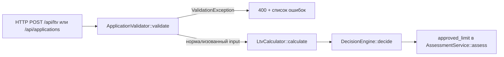

Разбор по коду, без изменений файлов.

## 1. Как считается решение: файлы, функции, порядок

Пайплайн собирается в `AppFactory::create()` (backend/src/AppFactory.php:30-39) и выглядит так:

Пошагово — входная точка `AssessmentService::assess(array $payload)` (AssessmentService.php:28-42):

1. **`ApplicationValidator::validate($payload)`** (ApplicationValidator.php:24-83) — проверяет VIN (делегирует `VinValidator::isValid`), год (через `VehicleAge::inYears`, против `rules['vehicle']`), пробег, стоимость, сумму, срок против порогов из `rules.php`. Любое нарушение → `ValidationException` (заявка дальше не идёт, это не `review`/`reject`, а ошибка валидации). Возвращает нормализованный массив `vin, year, mileage, market_value, requested_amount, term_months`.
2. **`LtvCalculator::calculate($input['requested_amount'], $input['market_value'])`** (LtvCalculator.php:15-26) — `round(сумма / стоимость * 100, 2)`, проценты с двумя знаками.
3. **`DecisionEngine::decide($ltv)`** (DecisionEngine.php:30-41) — единственное место, где рождается строка `approve`/`review`/`reject`:
   - `LTV < approve_max` (60.0) → `APPROVE`
   - `approve_max <= LTV <= review_max` (85.0) → `REVIEW`
   - `LTV > review_max` → `REJECT`
   Пороги `DecisionEngine` получает из `rules['ltv']` через конструктор (DecisionEngine.php:24-28; подключение — AppFactory.php:37).
4. **Лимит** в `assess()`: `approved_limit = requested_amount` при `approve`, иначе `0` (AssessmentService.php:39). Расчёт лимита по `rules.ltv_by_age` — задача LOAN-12, не сделана.
5. Попутно считается `vehicle_age` через `VehicleAge::inYears` (VehicleAge.php:18-21).

Числа `approve_max`/`review_max` задаются в `backend/config/rules.php:43-46`, код их не хардкодит.

## 2. Куда встанет правило «пробег > 400 000 км → review»

Проблема: `DecisionEngine::decide(float $ltv)` сейчас принимает **только LTV** (DecisionEngine.php:30) — про пробег он ничего не знает. Поэтому правило встанет в двух местах:

- **`DecisionEngine::decide()`** — новая ветка. Она должна отработать так, чтобы пробег «понижал» решение: сейчас порядок `approve → review → reject`; правило про пробег логично поставить **после** LTV-порогов, с переходом `approve → review` (например: сначала посчитать решение по LTV, затем `if ($mileage > $maxMileageReview && $decision === self::APPROVE) return self::REVIEW;`). Но чтобы не менять семантику существующих тестов по LTV — `reject` по LTV при большом пробеге остаётся `reject`.
- **Сигнатура `decide()`** — придётся передать пробег: либо `decide(float $ltv, int $mileage)`, либо передавать весь `$input`. Это каскадом меняет вызов в `AssessmentService::assess()` (AssessmentService.php:33): сейчас туда уходит только `$ltv`, а `$input['mileage']` уже есть в `$input` — данные на месте.
- **Порог** — по конвенции проекта не хардкодить: добавить в `rules.php`, например в `rules['vehicle']` ключ вроде `review_mileage_km => 400000`. Конструктор `DecisionEngine` (DecisionEngine.php:24-28) тогда должен принимать и этот порог — соответственно правится подключение в `AppFactory::create()` (AppFactory.php:37, сейчас передаётся только `$rules['ltv']`).

### Что для этого уже есть

- `mileage` есть в payload заявки и в нормализованном `$input` (ApplicationValidator.php:43-46, 78) — в `AssessmentService::assess()` доступно как `$input['mileage']`.
- Порог в конфиге: **нет** — `rules['vehicle']` содержит только `min_year`, `max_age_years`, `max_mileage_km` (rules.php:20-24); ключа для «пробег → review» нет, его нужно добавить.
- Механизм передачи порогов из конфига в `DecisionEngine`: есть (конструктор + AppFactory), но сейчас передаётся только блок `ltv`.

### Чего не хватает

- Ключа в `rules.php` для порога 400 000 км — нет, добавить.
- Передачи `mileage` в `DecisionEngine::decide()` — нет, сейчас сигнатура принимает только `float $ltv`.
- В `DecisionEngine` нет веток, учитывающих что-либо кроме LTV, — новая ветка пишется с нуля.

## 3. Что уже сейчас проверяется про пробег

Только **валидация диапазона**, не решение:

- `ApplicationValidator::validate()` (ApplicationValidator.php:43-46): пробег должен быть `0 <= mileage <= rules['vehicle']['max_mileage_km']`, где `max_mileage_km = 500000` (rules.php:23). Нарушение — ошибка валидации `errors['mileage']` («Пробег от 0 до 500000 км») и `ValidationException`, а не `review`/`reject`.
- Влияние пробега на решение `approve`/`review`/`reject`: **нет** — `DecisionEngine` про пробег не знает.
- Порог 400 000 км где-либо в коде или конфиге: **нет**.

Отмечу: новое правило (400 000) окажется внутри существующего валидационного диапазона (до 500 000), то есть заявки с пробегом 400 001–500 000 км сейчас проходят валидацию, но по новому правилу должны получать `review`.